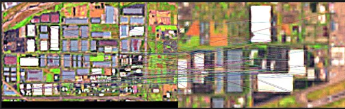
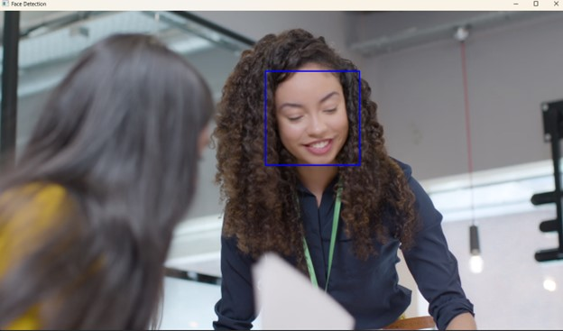
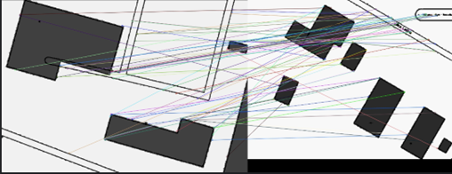
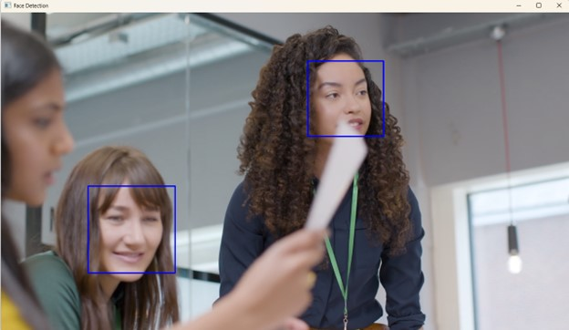

# STUDY OF DIGITAL IMAGE COMPARISON TECHNOLOGIES FOR TRACKING OBJECTS IN A VIDEO STREAM

> Oblective:
> to study the principles and features of practical application of technologies for comparing
> digital images for tracking objects in a video stream using
> specialized software libraries.

## What About

According to the sources and materials of remote sensing data, prepare a DataSet of the object selected for identification. Develop a program script that implements the classification by the content of the images prepared by the DataSet of the array.

GROUP OF REQUIREMENTS 3.
Develop a program script that implements object tracking in a digital video stream.
video stream. The content of the video, the object of tracking - choose yourself. The method and technology
of tracking should be chosen that ensures the stability of the object-tracking process for the selected
source data (video, tracked object).

**Requirements and limitations:**
Objects for identification can be area or point objects: forest
plantations, deforestation, reservoirs, areas of land surface erosion, agricultural
land, crop areas, buildings, cars, man-made/critical objects.
Identification - consists in establishing the linguistic name of the object and is carried out by
geometry of the contour.
All processing processes should be directed and implemented in relation to the object
identification.

**Remote sensing data sources**: 

1. Operational: 
   https://livingatlas2.arcgis.com/landsatexplorer/. 
2. High-precision: 
   https://www.bing.com/maps 

**Technical specifications**:  
The area of observation is choose by yourself.
Objects of identification select by yourself.
Date of operational data select by yourself.
Method and technology of of clustering/segmentation - should provide the ability to distinguish and
identification of the selected objects of observation.

### Mathematical model

The k-Means algorithm is one of the most popular clustering methods in machine learning and it is hard to imagine modern data processing methods without it. The main goal of this algorithm is to divide a data set into several groups, or clusters, so that objects within the same cluster are similar in some ways, and objects in different clusters are different.The main steps of the k-Means algorithm are as follows:

- Initialization of cluster centers: First, the cluster centers are randomly selected (these can be random objects from the dataset or objects selected in a special way).- Assigning each object to the nearest cluster: Each object in the dataset is assigned to the cluster that has the closest center using the distance between them. This distance can be calculated using different metrics, such as Euclidean distance or cosine distance, depending on the properties of the data.
- Update cluster centers: After all objects are assigned to clusters, the cluster centers are updated by calculating the average of all objects belonging to each cluster.- Repeating steps 2 and 3: These steps are repeated until the cluster centers change significantly or the maximum number of iterations is reached.
- Termination: The algorithm terminates when the cluster centers remain constant and the objects belong to the clusters.

Threshold segmentation 
It is realized by forming a decisive rule for testing the hypothesis: 

1. The hypothesis is that the current pixel belongs to region 1 at a given threshold level p - ω 1(p) 
2. The hypothesis is that the current pixel belongs to region 2 at a given threshold level p - ω 2(p) 

ORB algorithm (Oriented FAST and Rotated BRIEF)
This mathematical model describes the main steps of the ORB algorithm, which is used to detect and describe key points in images. 
Representation: 
Finding the key points (FAST): The FAST algorithm is used to detect locally found image points that have a significant change in intensity compared to their neighbors. This algorithm is based on comparing the intensity of pixels in windows of arbitrary size.
Key point orientation: Once the key points are detected, their orientation is calculated. This can be done, for example, by using luminance gradients within a certain radius of each key point.
Description of key points (BRIEF): For each key point, its descriptors are calculated. BRIEF generates short binary vectors that describe the local structural features of the points in the image. These binary vectors are generated based on the brightness patterns at specific positions around each key point.
Scaling and orientation of descriptors: The orientation and scale of the descriptors are adjusted to match the orientation and scale of the key points. This ensures invariance to changes in scale and orientation of objects in the image. 

VGG16 
The main idea behind the VGG16 model is a stack of convolutional layers that follow each other, with pooling applied after each convolutional layer, and there are several fully connected layers for classification

### Result

| Descriptors                      | Face identification             |
| -------------------------------- | ------------------------------- |
| ; |  |
| ; |  |

---
