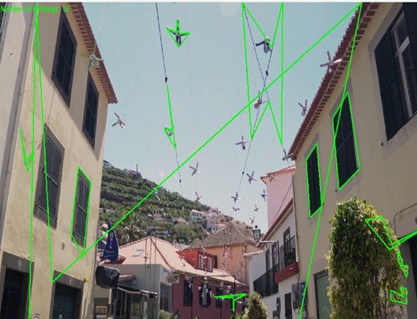
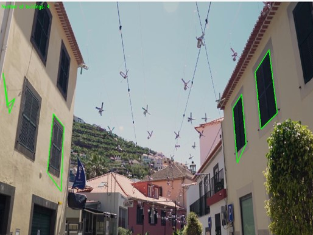
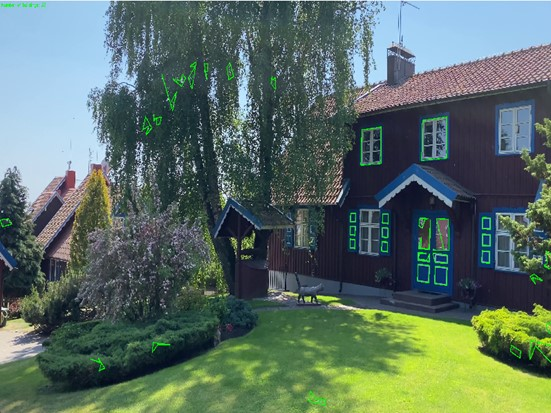

# RESEARCH OF TECHNOLOGIES FOR IMPROVING THE QUALITY OF DIGITAL IMAGES FOR COMPUTER VISION TASKS

> Oblective:
> to study the principles and features of practical application of technologies
> to improve the quality of digital images for Computer Vision tasks using
> specialized software libraries.

## What About

Conduct R&D research and implement a software script with specific methods and technological stages of Computer Vision: selection of a digital image and the identification object; loading the digital image; enhancing the quality of the digital image; vectorization of the identification object – establishing geometric features; identification of the object by geometric features.The selection of the digital image and the identification object is determined by the variants in the appendix table.

For enhancing the quality of the digital image, use:

- Color correction;
- Brightness histogram correction (for the entire image (global) / for a segment of the image (local));
- Image filtering methods/algorithms.

The choice of enhancement methods must be justified and should ensure the construction of the contour of the identification object.
For image vectorization (contour determination), use methods from basic Python libraries for digital image processing.
Identification should be carried out by comparing the geometric features (contour) of the image and the identification object.

**Digital image content / source** - Buildings
**The object of identification** - Windows

### Mathematical model

The mathematical model of the polyline approximation algorithm (Douglas-Packer algorithm) is used:
This algorithm is used to reduce the number of points in a complex contour while maintaining the overall shape of the contour. It works by calculating the distance between each point on the path and the line connecting the start and end points of the path. If the distance from a point to this line is less than a certain threshold (specified accuracy), the point is considered redundant and can be deleted.

### Result

;
  ;
  ;
  ;

;
