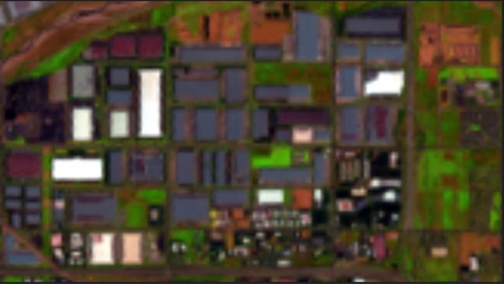
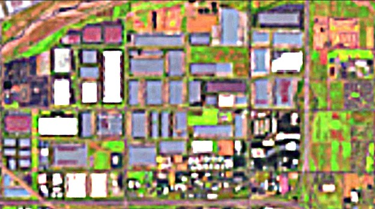
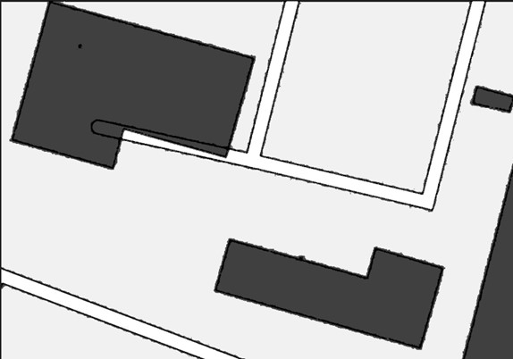
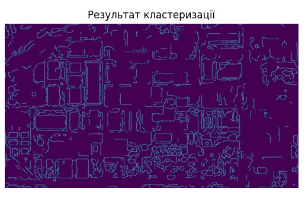
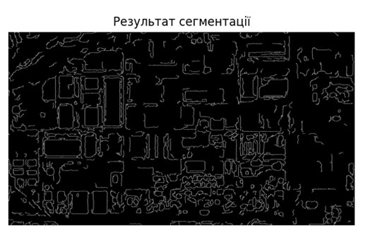
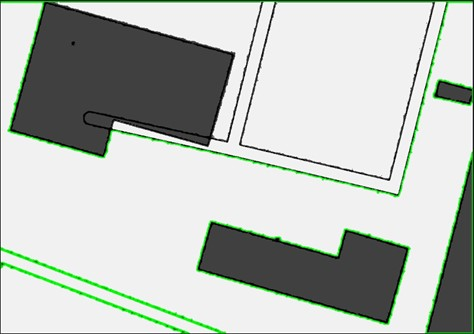
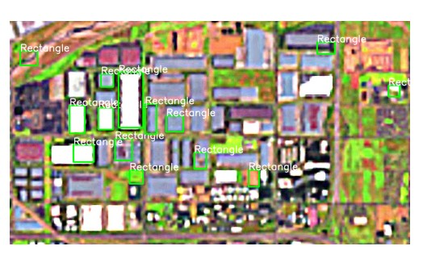

# RESEARCH OF TECHNOLOGIES FOR SEGMENTATION AND CLUSTERING OF DIGITAL IMAGES FOR COMPUTER VISION TASKS

> Oblective:
> to study the principles and features of practical application of segmentation technologies
> and clustering of digital images for Computer Vision tasks using
> specialized software libraries.

## What About

Develop a program script that provides digital image processing for
distinguishing and identifying selected objects on a digital image of the earth's surface with
low resolution digital images from open data sources
remote sensing of the Earth from space.
Procedure of organizational actions and functionality of the program script:

1. Select the observation area and identification objects - the same operational
   and high-precision remote sensing data sources - see Table.
2. Obtain digital raster images of the selected area of the earth's surface from operational
   and high-precision remote sensing data sources and save them in a file of the appropriate type.
3. Using a software script, perform color correction and/or
   filtering of remote sensing data from operational and high-precision sources with respect to the object
   identification.
4. Implement software color clustering of the images improved in step 3
   of the identification object on the remote sensing data from operational and high-precision sources.
5. To perform segmentation of digital images clustered in step 4 from operational and high-precision remote sensing data sources with the identification of the object contour.
6. By visual and/or software comparison of the contours of selected objects
   of vectorized images from operational and high-precision remote sensing data sources to identify these objects.
   identification of these objects.

**Requirements and limitations:**
Objects for identification can be area or point objects: forest
plantations, deforestation, reservoirs, areas of land surface erosion, agricultural
land, crop areas, buildings, cars, man-made/critical objects.
Identification - consists in establishing the linguistic name of the object and is carried out by
geometry of the contour.
All processing processes should be directed and implemented in relation to the object
identification.

**Remote sensing data sources**: 

1. Operational: 
   https://livingatlas2.arcgis.com/landsatexplorer/. 
2. High-precision: 
   https://www.bing.com/maps 

**Technical specifications**:  
The area of observation is choose by yourself.
Objects of identification select by yourself.
Date of operational data select by yourself.
Method and technology of of clustering/segmentation - should provide the ability to distinguish and
identification of the selected objects of observation.

### Mathematical model

The k-Means algorithm is one of the most popular clustering methods in machine learning and it is hard to imagine modern data processing methods without it. The main goal of this algorithm is to divide a data set into several groups, or clusters, so that objects within the same cluster are similar in some ways, and objects in different clusters are different.The main steps of the k-Means algorithm are as follows:

- Initialization of cluster centers: First, the cluster centers are randomly selected (these can be random objects from the dataset or objects selected in a special way).- Assigning each object to the nearest cluster: Each object in the dataset is assigned to the cluster that has the closest center using the distance between them. This distance can be calculated using different metrics, such as Euclidean distance or cosine distance, depending on the properties of the data.
- Update cluster centers: After all objects are assigned to clusters, the cluster centers are updated by calculating the average of all objects belonging to each cluster.- Repeating steps 2 and 3: These steps are repeated until the cluster centers change significantly or the maximum number of iterations is reached.
- Termination: The algorithm terminates when the cluster centers remain constant and the objects belong to the clusters.

Threshold segmentation 
It is realized by forming a decisive rule for testing the hypothesis: 

1. The hypothesis is that the current pixel belongs to region 1 at a given threshold level p - ω 1(p) 
2. The hypothesis is that the current pixel belongs to region 2 at a given threshold level p - ω 2(p) 

### Result

| Before Correction            | After                       |
| ---------------------------- | --------------------------- |
| ; |  |
| ; |  |

---

| Clustered Image              | Segmentation Image          |
| ---------------------------- | --------------------------- |
| ; |  |

---

| Identification Hight_Image   | Identification operative Omage |
| ---------------------------- | ------------------------------ |
| ; |     |
