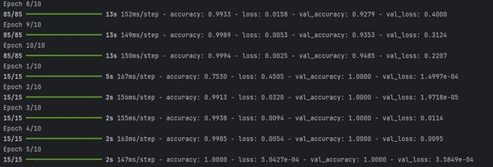
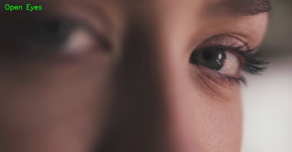
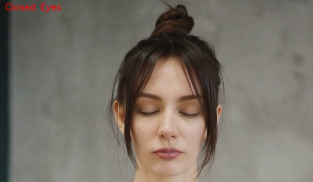

# RESEARCH OF TECHNOLOGIES FOR OBJECT IDENTIFICATION IN DIGITAL IMAGES FOR COMPUTER VISION TASKS

> Oblective:
> to study the principles and features of data preparation, synthesis, training and
> application of Artificial Neural Networks for practical problems of
> identification in Computer Vision technologies

## What About

Develop a Python program script that implements the computational algorithm
for identifying objects in digital images using artificial neural network technologies.
networks: data preparation; neural network design;
training an artificial neural network; application of the neural network

With the introduction of artificial neural network technologies, develop a program script to
to record the fact of closed/open eyes of the UAV operator.

### Mathematical model

The mathematical model of an artificial neuron is a simplified abstraction of a biological neuron used in neural networks. The main idea is to mathematically replicate the basic functions of a biological neuron, such as signal reception, processing, and transmission.The mathematical model of an artificial neuron consists of several components:

1. Signal Summation (weighted sum of input signals): Inputs to the neuron are received from other neurons or input data. Each input has its weight, reflecting its importance. The summator calculates the weighted sum of all input signals.
2. Activation Function: This function takes the value of the summator and regulates the neuron's output. It reflects the degree of activation, determining how active or inactive the neuron will be relative to a certain threshold.
3. Activation Threshold (bias): This value determines the threshold at which the neuron is considered active or inactive. If the value of the summator exceeds the activation threshold, the neuron activates.

The mathematical model of an artificial neuron can be expressed as:
y=f(i=1∑n​wi​⋅xi​+b)

### Result

The script was developed on the basis of the prepared dataset to further train the model to recognize closed/open eyes in a video stream.

| Procces Learning                |
| ------------------------------- |
|  |
|                                 |

---

| Open Eyes                       | Closed Eyes                     |
| ------------------------------- | ------------------------------- |
|  |  |
|                                 |                                 |

---
